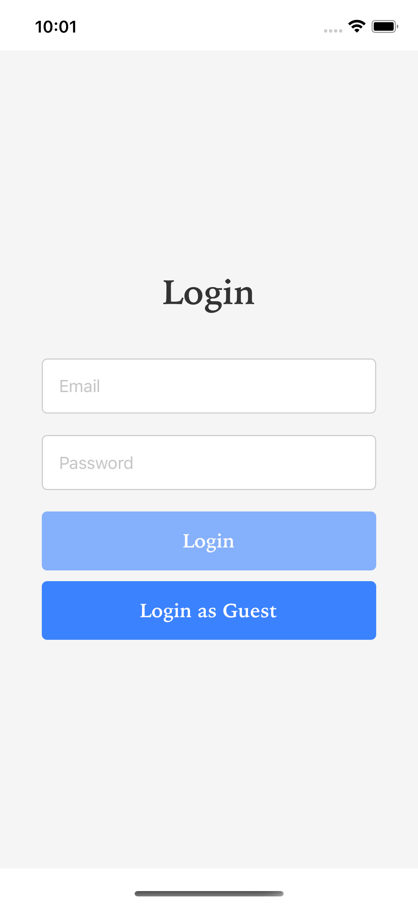
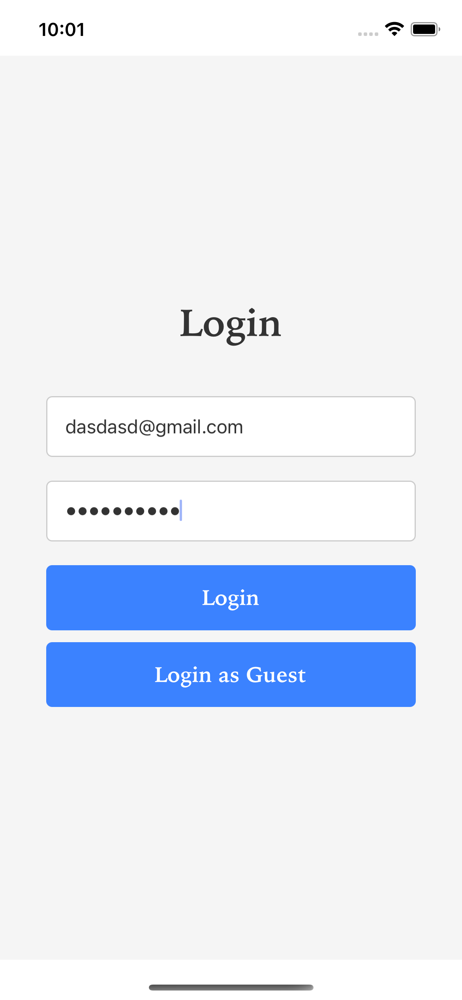
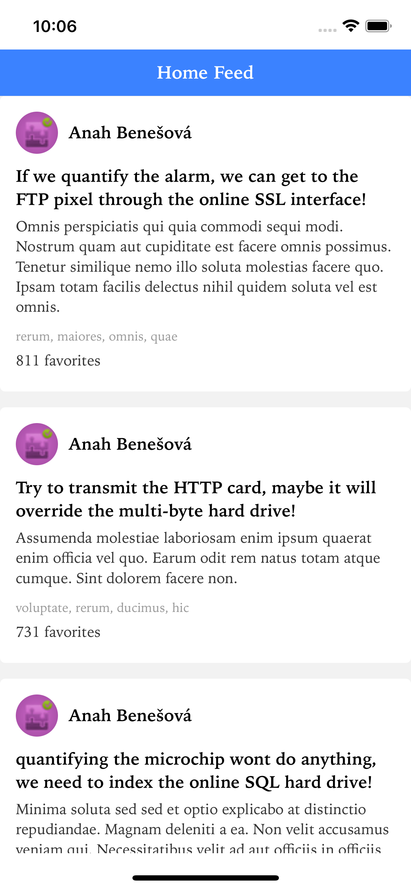
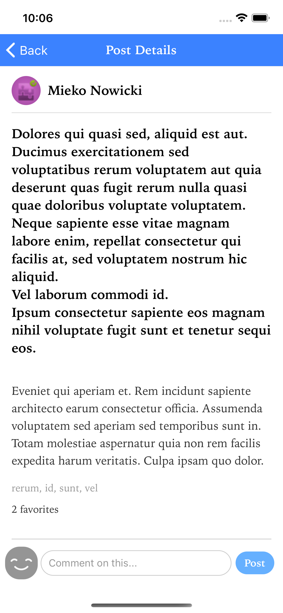
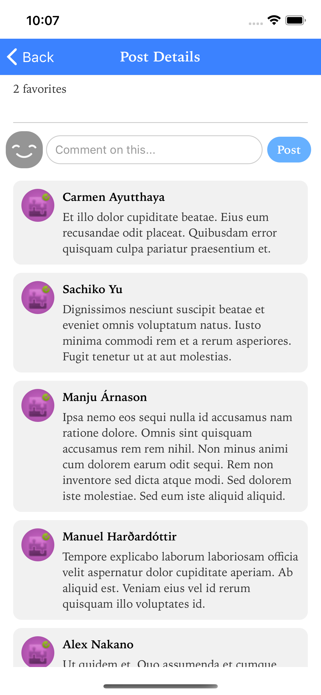
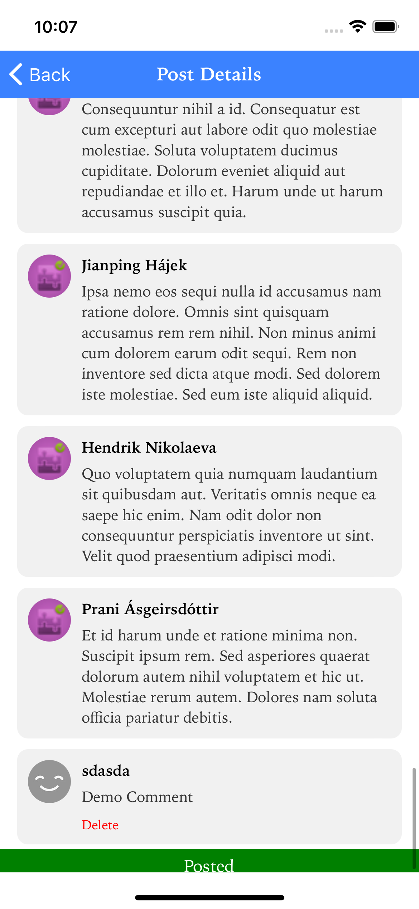

# Assignment - React Native Application

## Screenshots of Finished Product

|                        No Credentials                        |                      With Credentials                      |
| :----------------------------------------------------------: | :--------------------------------------------------------: |
|  |  |

---

|                     Home Feed                      |                       Post Details                       |
| :------------------------------------------------: | :------------------------------------------------------: |
|  |  |

---

|                          Post Details Comments                           |                              Adding a Comment                              |
| :----------------------------------------------------------------------: | :------------------------------------------------------------------------: |
|  |  |

---

## What I built?

A Social Media application with a Home Feed, Post Details page with comments
section.

## How to run/test the project?

### `npm install`

This will install all dependencies

### `npm run ios`

Runs the app in the development mode on iOS.\

### `npm run android`

Runs the app in the development mode on Android.\

## Assumptions:

1. The slug is the ID, this is just an assumption which I made based on the
   other APIs where the slug is used as ID for POST requests

## Additional Info:

1. I have used Axios and Redux Thunk as that is what the assignment instructed
   me to do but if I had a choice and there was no preference I would use Redux
   Toolkit to reduce boilerplate code
2. I have used a styledComponents folder to store any components where a default
   style is needed such as custom Font globally, alternatively we can also use
   one file to export all styled components in a file called themed.js
3. An improvement that could be made is making a common file for the Animated
   box that shows the text Post when comment is Posted, as this Animated text
   box can also be used to display "Deleted" after a comment is deleted.
4. I have not implemented the store posts so users can view them offline even if
   they kill the app due to time constraint. We could use React Native SQLite
   Storage or WatermelonDB (prefered) to implement this though.
